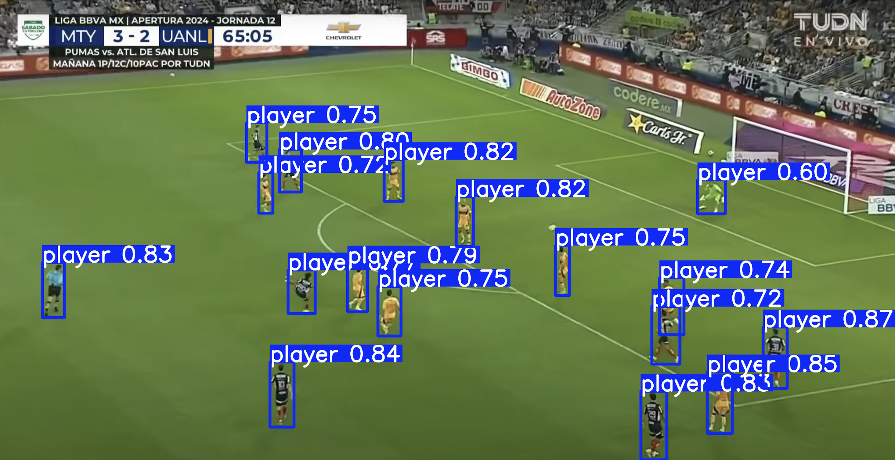

# Soccer YOLOv8 Tracking Project

This project uses **YOLOv8** to detect and track soccer players, referees, and the ball in match footage from a **SoccerNet** and **Kaggle** dataset. The goal is to enable free and accurate soccer analytics through computer vision.



---

## Features

- Detects **players**, **goalkeepers**, **referees**, and the **ball**
- Converts SoccerNet annotations into YOLO-compatible format
- Supports both **training** and **validation** data pipelines
- Includes label verification and correction scripts
- Clean modular codebase for preprocessing, training, and testing
- Tracks players and computes distance in pixels on video 

---

## Training Results Summary

The YOLOv8 model was trained for 40 epochs on the SoccerNet dataset to detect players, goalkeepers, referees, and the ball, and then again for another 40 epochs on the Kaggle soccer detection dataset. 

Loss curves show steady improvement across box, classification, and distance losses.

Validation loss closely tracks training loss, indicating good generalization.

Recall steadily improves to ~0.73.

mAP50 hits ~0.83, and mAP50-95 reaches ~0.58.

---

## Utilities

| Script | Purpose |
|--------|---------|
| `convert_to_yolo.py` | Converts SoccerNet annotations into YOLOv8 format |
| `tester.py` | Visually checks labels and annotations for each frame |
| `sample_data.py` | Extracts a % sample of the dataset for lightweight experiments |
| `fixed_labels.py` | Cleans mislabeled annotations from original dataset |
| `mover.py` | Merges scattered files into a single YOLO-style structure |
| `train_model.py` / `train_model_collab.py` | Main training scripts (local or Google Colab) |

---

## Images Folder

- Includes test images and YOLOv8 predictions for reference  
- Use these to validate your model or showcase its performance

---

## Model_User.py

- Includes option to use the model for object identification through photo and video
- Tracking and distance calculation per player is included for video input

---

## Data Notes

- Data originally had a large mixup of labels. Many players were marked as balls, and many balls as players. If there was an object 25% or less the size of the average player in a frame, and it was not marked as the ball while another object was then it was swapped! This made the data usable even with various flaws in the annotations.

---

## Developer Notes

A quick Python scrypt to alter the Kaggle dataset was used to fit to the YAML.
This was used and excluded. It simply adjusted the classification values of each file from a {player, ball} set to what we use in data.yaml.

TODO: could implement a function where someonem anually enters field values for clip for a more accureate representation of distance covered. Difficult to do without specifically limiting to a type of angle etc. 

Some quick commands I kept forgetting:

```bash
# Activate virtual environment
source .venv/bin/activate

